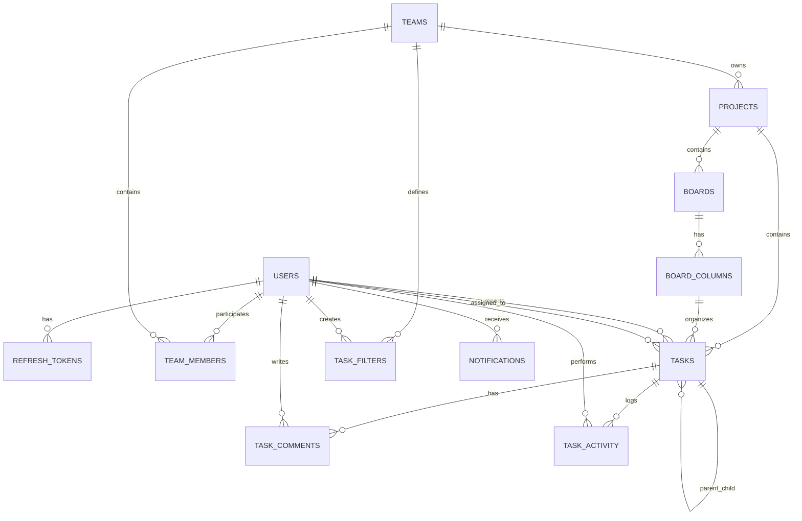

# Task Tracker --- Database Design Documentation

---

# ER Diagram

---

# 1. Authentication & Authorization

## Users

**Комментарий:** Таблица хранит учетные записи пользователей системы.
Используется для аутентификации и идентификации участников команд.

Field Type Description

---

id uuid (PK) User identifier
email varchar(255), UNIQUE Email
password_hash varchar(255) Password hash
name varchar(255) Name
avatar_url text Avatar URL
is_active boolean Active flag
created_at timestamptz Created at
updated_at timestamptz Updated at

---

## Refresh Tokens

**Комментарий:** Таблица хранения refresh-токенов для механизма
обновления JWT. Позволяет отзывать токены и управлять сессиями.

Field Type

---

id uuid (PK)
user_id uuid (FK → users.id)
token_hash varchar(255), UNIQUE
expires_at timestamptz
created_at timestamptz
revoked_at timestamptz

---

# 2. Teams & Roles

## Teams

**Комментарий:** Команда --- основной изолированный контекст (tenant).
Все проекты и участники привязаны к команде.

Field Type

---

id uuid (PK)
name varchar(255)
slug varchar(255), UNIQUE
created_by uuid (FK → users.id)
created_at timestamptz
updated_at timestamptz

---

## Team Members

**Комментарий:** Связующая таблица пользователей и команд. Определяет
роль пользователя в конкретной команде.

Field Type

---

id uuid (PK)
team_id uuid (FK → teams.id)
user_id uuid (FK → users.id)
role team_role_enum
joined_at timestamptz

---

# 3. Projects

**Комментарий:** Проект --- логическая единица внутри команды. Содержит
доски и задачи.

Field Type

---

id uuid (PK)
team_id uuid (FK → teams.id)
name varchar(255)
description text
is_archived boolean
created_by uuid (FK → users.id)
created_at timestamptz
updated_at timestamptz

---

# 4. Boards

## Boards

**Комментарий:** Доска отображает задачи проекта в виде Kanban или иной
группировки. Может иметь фильтр и режим группировки.

Field Type

---

id uuid (PK)
project_id uuid (FK → projects.id)
name varchar(255)
filter_query jsonb
group_by board_group_enum
created_at timestamptz
updated_at timestamptz

---

## Board Columns

**Комментарий:** Колонки доски определяют workflow. Порядок задается
полем position. Связаны со статусом задачи.

Field Type

---

id uuid (PK)
board_id uuid (FK → boards.id)
name varchar(255)
position integer
status task_status_enum
wip_limit integer
created_at timestamptz

---

# 5. Tasks

**Комментарий:** Основная бизнес-сущность системы. Поддерживает иерархию
(parent_id), перемещение между колонками и различные типы задач.

Field Type

---

id uuid (PK)
project_id uuid (FK → projects.id)
parent_id uuid (FK → tasks.id)
board_column_id uuid (FK → board_columns.id)
title varchar(500)
description text
type task_type_enum
status task_status_enum
priority task_priority_enum
reporter_id uuid (FK → users.id)
assignee_id uuid (FK → users.id)
position integer
story_points integer
due_date timestamptz
is_archived boolean
created_at timestamptz
updated_at timestamptz

---

# 6. Task Filters

**Комментарий:** Сохраняемые фильтры задач в формате JSON DSL. Могут
быть публичными внутри команды.

Field Type

---

id uuid (PK)
team_id uuid (FK → teams.id)
created_by uuid (FK → users.id)
name varchar(255)
query jsonb
is_public boolean
created_at timestamptz

---

# 7. Comments

**Комментарий:** Комментарии пользователей к задачам. Используются для
коммуникации и обсуждения.

Field Type

---

id uuid (PK)
task_id uuid (FK → tasks.id)
author_id uuid (FK → users.id)
content text
created_at timestamptz
updated_at timestamptz

---

# 8. Task Activity (Audit Log)

**Комментарий:** Журнал изменений задач. Позволяет отслеживать историю
изменений полей и действий пользователей.

Field Type

---

id uuid (PK)
task_id uuid (FK → tasks.id)
actor_id uuid (FK → users.id)
event_type task_event_enum
field_name varchar(100)
old_value jsonb
new_value jsonb
created_at timestamptz

---

# 9. Notifications

**Комментарий:** Уведомления пользователей. Используются для
realtime-информирования через Socket.IO и фоновой обработки через
BullMQ.

Field Type

---

id uuid (PK)
user_id uuid (FK → users.id)
type notification_type_enum
payload jsonb
is_read boolean
created_at timestamptz

---
